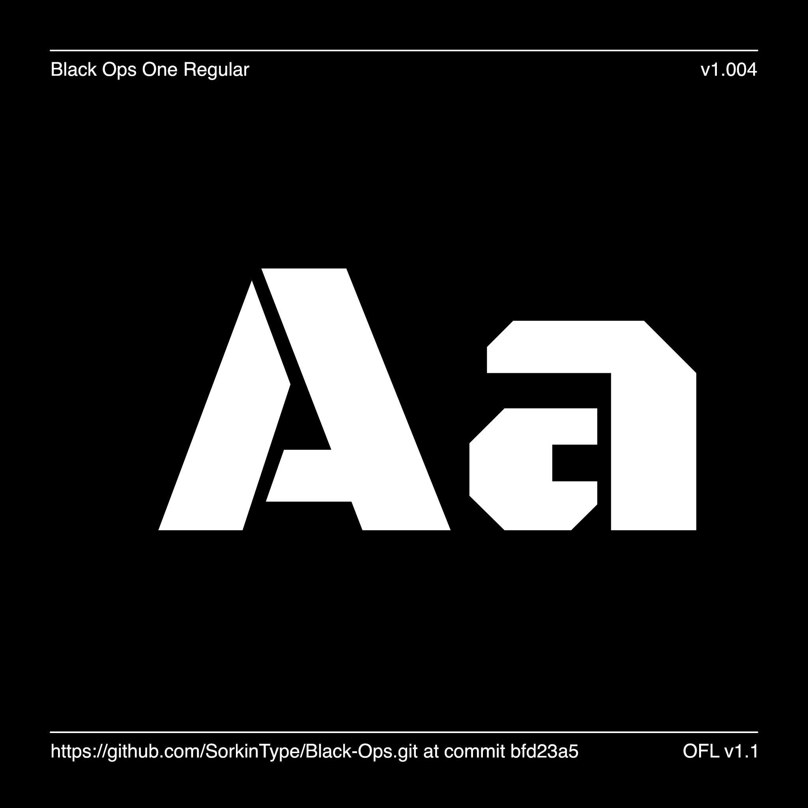

# My Font

[![][Fontbakery]](https://SorkinType.github.io/Black-Ops/fontbakery/fontbakery-report.html)
[![][Universal]](https://SorkinType.github.io/Black-Ops/fontbakery/fontbakery-report.html)
[![][GF Profile]](https://SorkinType.github.io/Black-Ops/fontbakery/fontbakery-report.html)
[![][Outline Correctness]](https://SorkinType.github.io/Black-Ops/fontbakery/fontbakery-report.html)
[![][Shaping]](https://SorkinType.github.io/Black-Ops/fontbakery/fontbakery-report.html)

[Fontbakery]: https://img.shields.io/endpoint?url=https%3A%2F%2Fraw.githubusercontent.com%2FSorkinType%2FBlack-Ops%2Fgh-pages%2Fbadges%2Foverall.json
[GF Profile]: https://img.shields.io/endpoint?url=https%3A%2F%2Fraw.githubusercontent.com%2FSorkinType%2FBlack-Ops%2Fgh-pages%2Fbadges%2FGoogleFonts.json
[Outline Correctness]: https://img.shields.io/endpoint?url=https%3A%2F%2Fraw.githubusercontent.com%2FSorkinType%2FBlack-Ops%2Fgh-pages%2Fbadges%2FOutlineCorrectnessChecks.json
[Shaping]: https://img.shields.io/endpoint?url=https%3A%2F%2Fraw.githubusercontent.com%2FSorkinType%2FBlack-Ops%2Fgh-pages%2Fbadges%2FShapingChecks.json
[Universal]: https://img.shields.io/endpoint?url=https%3A%2F%2Fraw.githubusercontent.com%2FSorkinType%2FBlack-Ops%2Fgh-pages%2Fbadges%2FUniversal.json

Black Ops is a low contrast semi geometric typeface inspired by military stencil lettering. Black Ops is heavy, sturdy, and punchy. Because of the small cuts found in stencils like this one, Black Ops will look best when used at medium to large sizes.

## About

James Grieshaber, is a type designer
Eben Sorkin, is a type designer and art director

## Languages

360 languages of Latin script:
------------------------------
According to Hyperglot made by Rosetta Type the Black Ops One has base support for 360 of the 459 languages of Latin script. These include:

Abron, Acheron, Achinese, Achuar-Shiwiar, Adangme, Afar, Afrikaans, Aguaruna, Amahuaca, Amarakaeri, Amis, Andaandi, Dongolawi, Anuta, Ao Naga, Apinayé, Arabela, Aragonese, Arbëreshë Albanian, Arvanitika Albanian, Asháninka, Ashéninka Perené, Asturian, Asu (Tanzania), Atayal, Awa-Cuaiquer, Baatonum, Bafia, Balinese, Baoulé, Bari, Basque, Batak Dairi, Batak Karo, Batak Mandailing, Batak Simalungun, Batak Toba, Bemba (Zambia), Bena (Tanzania), Biali, Bikol, Bini, Bislama, Boko (Benin), Bora, Borana-Arsi-Guji Oromo, Bosnian, Breton, Buginese, Candoshi-Shapra, Caquinte, Caribbean Hindustani, Cashibo-Cacataibo, Cashinahua, Catalan, Cebuano, Central Aymara, Central Kurdish, Central Nahuatl, Chachi, Chamorro, Chavacano, Chayahuita, Chiga, Chiltepec Chinantec, Chokwe, Chuukese, Cimbrian, Cofán, Congo Swahili, Cook Islands Māori, Cornish, Corsican, Creek, Crimean Tatar, Croatian, Czech, Danish, Dehu, Dendi (Benin), Dimli, Dutch, Eastern Abnaki, Eastern Arrernte, Eastern Oromo, Embu, English, Ese Ejja, Falam Chin, Fanti, Faroese, Fijian, Filipino, Finnish, Fon, French, Friulian, Ga, Gagauz, Galician, Ganda, Garifuna, Ga’anda, German, Gheg Albanian, Gilbertese, Gonja, Gooniyandi, Guadeloupean Creole French, Gusii, Gwichʼin, Haitian, Hakha Chin, Hani, Hiligaynon, Ho-Chunk, Hopi, Huastec, Hungarian, Hän, Ibibio, Icelandic, Igbo, Iloko, Inari Sami, Indonesian, Irish, Istro Romanian, Italian, Ixcatlán Mazatec, Jamaican Creole English, Japanese, Javanese, Jola-Fonyi, K'iche', Kabuverdianu, Kaingang, Kala Lagaw Ya, Kalaallisut, Kalenjin, Kamba (Kenya), Kaonde, Karelian, Kashubian, Kekchí, Kenzi, Mattokki, Khasi, Kikuyu, Kimbundu, Kinyarwanda, Kirmanjki, Kituba (DRC), Kongo, Konzo, Krio, Kuanyama, Kven Finnish, Kölsch, Ladin, Ladino, Latgalian, Latin, Ligurian, Lingala, Lithuanian, Lombard, Low German, Lower Sorbian, Luba-Katanga, Luba-Lulua, Lule Sami, Luo (Kenya and Tanzania), Luxembourgish, Macedo-Romanian, Madurese, Makhuwa, Makhuwa-Meetto, Makonde, Makwe, Malagasy, Malaysian, Maltese, Manx, Maore Comorian, Maori, Mapudungun, Marshallese, Matsés, Mauritian Creole, Mende (Sierra Leone), Meriam Mir, Meru, Metlatónoc Mixtec, Mezquital Otomi, Mi'kmaq, Minangkabau, Mirandese, Miyobe, Mizo, Mohawk, Montagnais, Montenegrin, Munsee, Murrinh-Patha, Murui Huitoto, Mwani, Mískito, Naga Pidgin, Ndonga, Neapolitan, Ngazidja Comorian, Niuean, Nobiin, Nomatsiguenga, North Ndebele, Northern Kissi, Northern Kurdish, Northern Qiandong Miao, Northern Sami, Northern Uzbek, Norwegian, Nyamwezi, Nyanja, Nyankole, Nyemba, Nzima, Occitan, Ojitlán Chinantec, Orma, Oroqen, Palauan, Paluan, Pampanga, Papantla Totonac, Papiamento, Pedi, Picard, Pichis Ashéninka, Piemontese, Pijin, Pintupi-Luritja, Pipil, Pohnpeian, Polish, Portuguese, Potawatomi, Purepecha, Páez, Quechua, Romanian, Romansh, Rotokas, Rundi, Rwa, Samburu, Samoan, Sango, Sangu (Tanzania), Saramaccan, Sardinian, Scottish Gaelic, Secoya, Sena, Seri, Seselwa Creole French, Shambala, Sharanahua, Shawnee, Shilluk, Shipibo-Conibo, Shona, Shuar, Sicilian, Silesian, Siona, Slovak, Slovenian, Soga, Somali, Soninke, South Ndebele, Southern Aymara, Southern Dagaare, Southern Qiandong Miao, Southern Sami, Southern Sotho, Spanish, Sranan Tongo, Standard Estonian, Standard Latvian, Standard Malay, Sundanese, Swahili, Swati, Swedish, Swiss German, Tagalog, Tahitian, Taita, Tedim Chin, Teso, Tetum, Tetun Dili, Timne, Tiv, Toba, Tojolabal, Tok Pisin, Tokelau, Tonga (Tonga Islands), Tonga (Zambia), Tosk Albanian, Totontepec Mixe, Tsonga, Tswana, Tumbuka, Turkish, Turkmen, Twi, Tzeltal, Tzotzil, Uab Meto, Umbundu, Ume Sami, Upper Guinea Crioulo, Upper Sorbian, Venda, Venetian, Veps, Vietnamese, Võro, Waama, Walloon, Walser, Wangaaybuwan-Ngiyambaa, Waorani, Waray (Philippines), Warlpiri, Wasa, Wayuu, Welsh, West Central Oromo, West-Central Limba, Western Abnaki, Western Frisian, Wik-Mungkan, Wiradjuri, Wolof, Xavánte, Xhosa, Yagua, Yanesha', Yanomamö, Yao, Yapese, Yindjibarndi, Yoruba, Yucateco, Zapotec, Zulu, Záparo

## Building

Fonts are built automatically by GitHub Actions - take a look in the "Actions" tab for the latest build.

If you want to build fonts manually on your own computer:

* `make build` will produce font files.
* `make test` will run [FontBakery](https://github.com/googlefonts/fontbakery)'s quality assurance tests.
* `make proof` will generate HTML proof files.

The proof files and QA tests are also available automatically via GitHub Actions - look at https://SorkinType.github.io/Black-Ops.

## Changelog

When you update your font (new version or new release), please report all notable changes here, with a date.
[Font Versioning](https://github.com/googlefonts/gf-docs/tree/main/Spec#font-versioning) is based on semver. 
Changelog example:

**12 July 2021. Version 1.004**

- SIGNIFICANT Many new langauges are supported.
- SIGNIFICANT Many new Symbols are present.

## License

This Font Software is licensed under the SIL Open Font License, Version 1.1.
This license is available with a FAQ at
https://scripts.sil.org/OFL

## Repository Layout

This font repository structure is inspired by [Unified Font Repository v0.3](https://github.com/unified-font-repository/Unified-Font-Repository), modified for the Google Fonts workflow.
